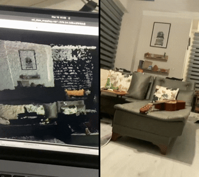

# SSL-SLAM Installation and Execution Guide

This project provides a **Dockerized setup** of SSL-SLAM for the Intel RealSense **L515** camera.

Original repository introduced [here](https://github.com/wh200720041/ssl_slam.git).

## 1. Check Librealsense Version
```bash
g++ version_check.cpp -o version_check -lrealsense2
./version_check
```

## 2. Check ROS Wrapper (realsense-ros) Version
```bash
cd src/realsense-ros/
git describe --tags
```

## 3. Build Docker Image
```bash
docker build -t my_ssl_slam .
```

## 4. Fix Display Issue
Run this before starting Docker.
```bash
xhost +local:root
```

## 5. Run Docker Container
```bash
docker run -it    --privileged    --device=/dev/bus/usb    --device-cgroup-rule='c 81:* rmw'    --device-cgroup-rule='c 189:* rmw'    -e DISPLAY=$DISPLAY    -e QT_X11_NO_MITSHM=1    -v /tmp/.X11-unix:/tmp/.X11-unix:rw    -v /dev:/dev    -v ~/Downloads:/root/Downloads    my_ssl_slam
```

## 6. Launch the Application
```bash
roslaunch ssl_slam ssl_slam_L515.launch
```

## 7. Example: Mapping a Room Demo

Below is a demonstration of SSL-SLAM in action while mapping a room:

